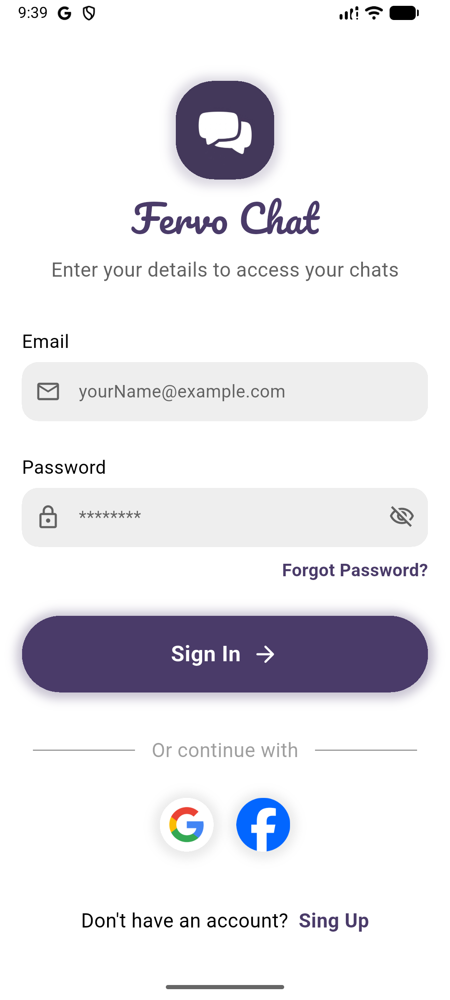
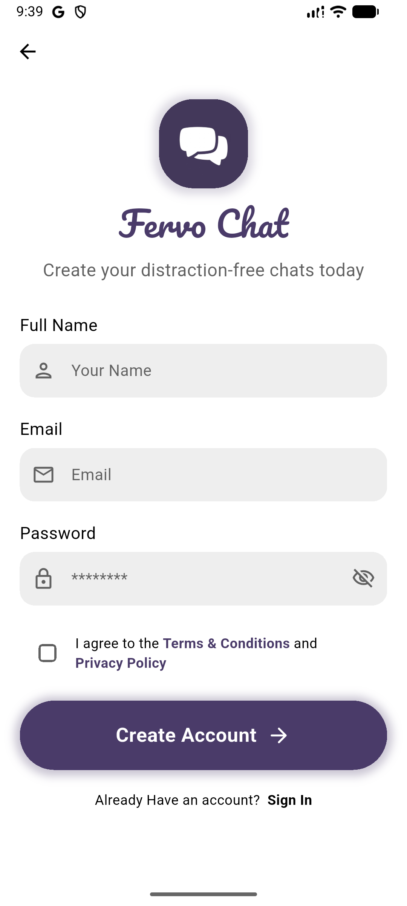
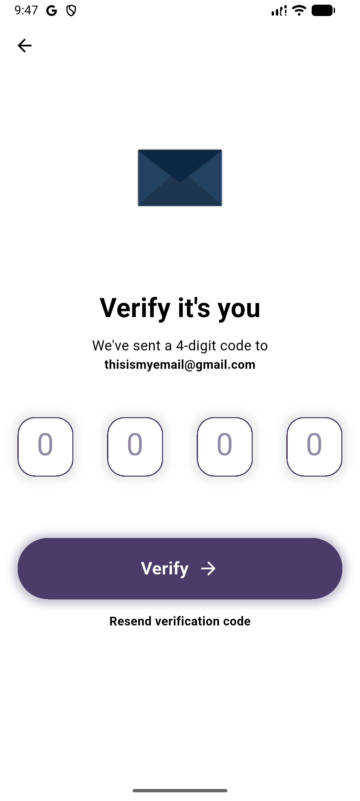
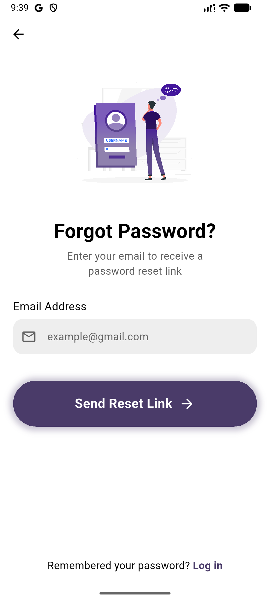

# 🔥 Fervo Chat

<p align="center">
  
</p>

<p align="center">
  A real-time chat application built with <strong>Flutter</strong> and <strong>Firebase</strong>, featuring modern authentication methods, OTP email verification, and a beautiful UI with dark/light theme support.
</p>

<p align="center">
  
  
  
  
  
</p>

---

## 📖 Overview

**Fervo Chat** is a feature-rich, real-time messaging application developed using Flutter and powered by Firebase. It allows users to register, sign in using multiple authentication methods (Email/Password, Google, Facebook), verify their email via OTP, and chat with other users in real-time. The app supports dark and light themes, profile management, and provides a smooth, engaging user experience with Lottie animations and haptic feedback.

---

# 🤖 Download the Android app here.
[Donwload now](https://ahmedeltantawi.netlify.app/fervo_chat.apk)

---


### 📱DEMO


https://github.com/user-attachments/assets/540b9b4e-a5ae-47bb-a4fb-5450db1c21ca


---

## 📱 App Screenshots

<table>
  <tr>
    <td align="center"><strong>Login Page</strong></td>
    <td align="center"><strong>Register Page</strong></td>
  </tr>
  <tr>
    <td></td>
    <td></td>
  </tr>
  <tr>
    <td align="center"><strong>OTP Verification</strong></td>
    <td align="center"><strong>Forget Password</strong></td>
  </tr>
  <tr>
    <td></td>
    <td></td>
  </tr>
</table>
---

## ✨ Features

### 🔐 Authentication
- **Email & Password Sign In** — Classic authentication with Firebase Auth
- **Google Sign In** — One-tap Google authentication
- **Facebook Sign In** — Seamless Facebook login integration
- **Email OTP Verification** — 4-digit OTP sent to email for account verification during registration
- **Auto Login** — Remembers user session; skips sign-in if already authenticated
- **Sign Out** — Secure logout from the drawer menu

### 💬 Real-Time Chat
- **Real-time messaging** powered by Cloud Firestore streams
- **Chat bubbles** — Distinct styles for sent and received messages
- **Auto-scroll** to latest messages with smooth animation
- **Empty state** — Beautiful Lottie animation when no messages exist yet
- **Ordered messages** — Messages sorted by creation timestamp

### 👤 User Profile
- **Account View** — Display user name, email, and profile photo
- **Profile Photo** — Update profile photo with URL (stored in Firestore)
- **Default Avatar** — Fallback profile image when no photo is set

### 🎨 Theming
- **Dark Mode & Light Mode** — Toggle between themes using a CupertinoSwitch
- **Theme Persistence** — Managed via Provider state management
- **Consistent Design** — All screens respect the active theme

### 📱 UX Enhancements
- **Splash Screen** — Custom native splash screen with app branding
- **Custom App Icon** — Branded launcher icon for Android & iOS
- **Lottie Animations** — Animated illustrations for OTP, errors, and empty states
- **Vibration Feedback** — Haptic feedback on errors and validation failures
- **Loading Indicators** — Modal progress HUD during async operations
- **Internet Connectivity Check** — Validates internet before network requests
- **Email Validation** — Real-time email format validation
- **Custom Font** — Pacifico font for branding elements

### 🗂 Navigation
- **Drawer Navigation** — Side menu with Home, Account, Settings, and Logout
- **Named Routes** — Clean navigation with named route system


---

## 🏗 Project Structure

```
lib/
├── main.dart                                # App entry point, Firebase & OTP config
├── firebase_options.dart                    # Firebase configuration
│
├── Views/                                   # All app screens
│   ├── sign_in_view.dart                    # Sign in (Email, Google, Facebook)
│   ├── register_view.dart                   # User registration
│   ├── otp_view.dart                        # Email OTP verification
│   ├── home_view.dart                       # Friends list (main screen)
│   ├── chat_view.dart                       # Real-time chat between two users
│   ├── acount_view.dart                     # User profile/account page
│   ├── updata_profile_photo.dart            # Update profile photo
│   ├── settings_view.dart                   # Dark/Light mode toggle
│   ├── drawer_view.dart                     # Side navigation drawer
│   ├── reset_password_view.dart             # Reset password screen
│   └── error_view.dart                      # Error display page
│
├── Widgets/                                 # Reusable UI components
│   ├── app_icon_widget.dart                 # App icon/logo widget
│   ├── chat_bubble.dart                     # Chat message bubbles
│   ├── custom_bottom.dart                   # Reusable button widget
│   ├── custom_check_box.dart                # Custom checkbox widget
│   ├── custom_form_text_field.dart           # Reusable form text field
│   ├── friend_widget.dart                   # Friend list item widget
│   ├── google_and_facebook_login_widget.dart # Google & Facebook login buttons
│   ├── horizontal_text_line.dart            # Horizontal divider with text
│   ├── page_label.dart                      # Page title label widget
│   ├── password_text_field_widget.dart       # Password input with toggle visibility
│   ├── sing_in_icon.dart                    # Sign-in provider icon widget
│   └── terms_and_conditions_widget.dart     # Terms & conditions checkbox widget
│
├── cubits/                                  # BLoC/Cubit state management
│   ├── login_cubit/
│   │   ├── login_cubit.dart                 # Login logic & state management
│   │   └── login_state.dart                 # Login states definition
│   ├── password_cubit/
│   │   ├── password_cubit.dart              # Password visibility toggle cubit
│   │   └── password_state.dart              # Password states definition
│   └── register/
│       ├── register_cubit.dart              # Registration logic & state management
│       └── register_state.dart              # Registration states definition
│
├── auth/                                    # Authentication logic
│   ├── sing_in_methods.dart                 # Google & Facebook sign-in
│   ├── user_login.dart                      # Email/password login
│   ├── register_function.dart               # User registration with Firebase
│   ├── make_user_and_sing_in_function.dart   # Create user doc & sign in
│   └── isTheEmailExists.dart                # Check if email already exists
│
├── models/                                  # Data models
│   ├── friend_model.dart                    # User/Friend data model
│   └── massage_model.dart                   # Message data model
│
├── helper/                                  # Utility functions & constants
│   ├── consts.dart                          # App constants (colors, collection names)
│   ├── extensions.dart                      # String extensions (capitalize)
│   ├── show_snack_bar.dart                  # SnackBar helper function
│   ├── vibration.dart                       # Haptic/vibration feedback helper
│   └── web_view.dart                        # In-app web view launcher
│
└── theme/                                   # Theming
    ├── dark_mode_them.dart                  # Dark theme data
    ├── light_mode_theme.dart                # Light theme data
    └── theme_probider.dart                  # ThemeProvider with ChangeNotifier
```

---

## 📦 Dependencies

| Package | Purpose |
|---------|---------|
| `firebase_core` | Firebase initialization |
| `firebase_auth` | Email/Password, Google, Facebook authentication |
| `cloud_firestore` | Real-time database for messages & users |
| `google_sign_in` | Google Sign-In integration |
| `flutter_facebook_auth` | Facebook Sign-In integration |
| `email_otp` | OTP generation & verification via email |
| `email_validator` | Email format validation |
| `flutter_bloc` | BLoC state management |
| `provider` | Theme state management |
| `lottie` | JSON-based animations |
| `vibration` | Haptic/vibration feedback |
| `flutter_native_splash` | Native splash screen |
| `flutter_launcher_icons` | Custom app launcher icon |
| `modal_progress_hud_nsn` | Loading overlay during async operations |
| `internet_connection_checker_plus` | Internet connectivity detection |

---

## 🚀 Getting Started

### Prerequisites

- Flutter SDK `^3.10.7`
- Firebase project configured (Android & iOS)
- Google & Facebook developer accounts (for social sign-in)

### Installation

1. **Clone the repository**
   ```bash
   git clone https://github.com/ahmed-eltantawi/Chat-app.git
   cd Chat-app
   ```

2. **Install dependencies**
   ```bash
   flutter pub get
   ```

3. **Configure Firebase**
   - Create a Firebase project at [console.firebase.google.com](https://console.firebase.google.com)
   - Enable **Authentication** (Email/Password, Google, Facebook)
   - Enable **Cloud Firestore**
   - Download and place `google-services.json` (Android) and `GoogleService-Info.plist` (iOS)

4. **Generate splash screen & app icon**
   ```bash
   dart run flutter_native_splash:create
   dart run flutter_launcher_icons
   ```

5. **Run the app**
   ```bash
   flutter run
   ```

---

## 🧰 Firebase Setup

### Firestore Collections

| Collection | Document Fields |
|------------|-----------------|
| `users` | `name`, `id` (email), `image`, `createdAt` |
| `{chatId}` | `text`, `id` (sender email), `createdAt` |

### Authentication Providers

- ✅ Email/Password
- ✅ Google
- ✅ Facebook

---

## 📚 What I Learned & Applied

This project was a significant learning experience where I explored and applied many important technologies and concepts in Flutter development:

### 🔥 Firebase (Core Focus)

| Topic | What I Learned |
|-------|----------------|
| **Firebase Core** | Setting up and initializing Firebase in a Flutter project |
| **Firebase Auth** | Implementing multiple sign-in methods (Email/Password, Google, Facebook) |
| **Cloud Firestore** | Using Firestore as a real-time NoSQL database for messages and user data |
| **Firestore Streams** | Using `StreamBuilder` with Firestore `snapshots()` for real-time updates |
| **Firestore Queries** | Ordering, filtering, and limiting data from collections |
| **Session Management** | Checking `FirebaseAuth.instance.currentUser` to maintain login state |

### 🔑 OTP (One-Time Password) Verification

| Topic | What I Learned |
|-------|----------------|
| **Email OTP** | Sending a 4-digit verification code to user's email during registration |
| **SMTP Config** | Setting up Gmail SMTP server for sending OTP emails |
| **OTP UI Flow** | Building a complete OTP input UI with auto-focus between digit fields |
| **Resend OTP** | Implementing the ability to resend the verification code |

### 📳 Vibration / Haptic Feedback

| Topic | What I Learned |
|-------|----------------|
| **Vibration Plugin** | Adding physical feedback (vibration) when errors occur |
| **Platform Check** | Using `Vibration.hasVibrator()` to check device capability first |
| **UX Enhancement** | Providing tactile feedback on validation errors and network issues |

### 🎬 Splash Screen

| Topic | What I Learned |
|-------|----------------|
| **Native Splash** | Configuring a custom native splash screen with brand colors and logo |
| **Android 12+** | Handling the new Android 12 splash screen API |
| **Fullscreen Mode** | Making the splash screen cover the entire display |

### 🔐 Social Authentication

| Topic | What I Learned |
|-------|----------------|
| **Google Sign-In** | Full OAuth flow with `google_sign_in`, including credential exchange with Firebase |
| **Facebook Sign-In** | Facebook Login with `flutter_facebook_auth`, with duplicate account error handling |

### 🎨 State Management

| Topic | What I Learned |
|-------|----------------|
| **Provider** | Using `ChangeNotifierProvider` for theme management across the app |
| **BLoC Pattern** | Understanding the BLoC architecture for scalable state management |

### 🌗 Theming System

| Topic | What I Learned |
|-------|----------------|
| **Dark & Light Mode** | Building a complete theme switching system |
| **ThemeData** | Creating custom `ThemeData` for both dark and light modes |
| **Dynamic Toggle** | Using `CupertinoSwitch` with Provider to switch themes at runtime |

### 🎞 Lottie Animations

| Topic | What I Learned |
|-------|----------------|
| **JSON Animations** | Using Lottie for lightweight, scalable animations |
| **Conditional Swap** | Swapping animation files based on app state (success/error) |
| **Playback Control** | Controlling animation repeat and playback behavior |

### 🌐 Internet Connectivity

| Topic | What I Learned |
|-------|----------------|
| **Connection Checker** | Verifying internet connectivity before making network requests |
| **User Feedback** | Showing appropriate error messages when offline |

### ✅ Form Validation

| Topic | What I Learned |
|-------|----------------|
| **Email Validation** | Using `email_validator` for real-time email format checking |
| **Form Keys** | Using `GlobalKey<FormState>` for form validation |
| **Custom Validators** | Input validation with user-friendly error messages |

### 🧩 Other Skills Applied

| Skill | Details |
|-------|---------|
| **Custom Fonts** | Integrating the Pacifico font family for branding |
| **Custom App Icon** | Using `flutter_launcher_icons` for branded app icons |
| **Named Routes** | Implementing clean navigation architecture |
| **Reusable Widgets** | Building reusable components (buttons, text fields, chat bubbles) |
| **Data Models** | Creating model classes with factory constructors for JSON parsing |
| **Extensions** | Writing Dart string extensions (e.g., capitalize) |
| **Error Handling** | Comprehensive try-catch with specific Firebase error codes |
| **Modal Progress HUD** | Showing loading overlays during async operations |

---

## 🎨 App Theme

| Property | Value |
|----------|-------|
| Primary Color | `#2E465E` |
| Splash Background | `#42385A` |
| Font Family | Pacifico (branding), Default (UI) |

---


## 👨‍💻 Developer

**Ahmed Eltantawi**

---

<p align="center">
  Made with ❤️ using Flutter & Firebase
</p>
